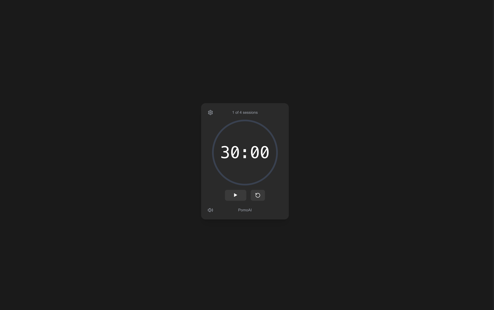

# PomoAI - A Modern Pomodoro Timer

    A minimalist Pomodoro timer built with Next.js and Tailwind CSS. Enhance your productivity with this elegant, AI-inspired timer application.



## Features

- 🎯 Customizable work/break sessions
- 📊 Session tracking (4 sessions)
- 🎨 Sleek, dark-themed UI
- ⚡ Real-time progress visualization
- 🔄 Session management
- ⚙️ Settings customization
- 🔔 Audio notifications
- 📱 Responsive design
- 🌙 Dark mode optimized

## Tech Stack

- [Next.js 14](https://nextjs.org/) - React Framework
- [Tailwind CSS](https://tailwindcss.com/) - Styling
- [TypeScript](https://www.typescriptlang.org/) - Type Safety
- [Lucide Icons](https://lucide.dev/) - Modern Icons

## Getting Started

1. Clone the repository:

git clone https://github.com/yourusername/pomoai.git

2. Install dependencies:

npm install

3. Run the development server:

npm run dev

4. Open [http://localhost:3000](http://localhost:3000) with your browser

## Usage

- Play/Pause: Control your work session
- Reset: Start fresh at any time
- Settings: Customize your timer durations
- Progress Bar: Visual feedback of your session
- Session Counter: Track your progress through multiple sessions

## Customization

The timer can be customized through the settings panel or by modifying the constants in `src/components/PomodoroTimer.tsx`:

```typescript
const WORK_MINUTES = 25;
const BREAK_MINUTES = 5;
const TOTAL_SESSIONS = 4;
```

## Contributing

Contributions are welcome! Please feel free to submit a Pull Request.

1. Fork the project
2. Create your feature branch (`git checkout -b feature/NewFeature`)
3. Commit your changes (`git commit -m 'Add some NewFeature'`)
4. Push to the branch (`git push origin feature/NewFeature`)
5. Open a Pull Request

## License

This project is licensed under the MIT License - see the [LICENSE](LICENSE) file for details.

## Acknowledgments

- Built with modern web technologies
- Inspired by the [Pomodoro Technique](https://en.wikipedia.org/wiki/Pomodoro_Technique)
- Design influenced by AI-driven interfaces

## Roadmap

- [ ] AI-powered session recommendations
- [ ] Integration with productivity tools
- [ ] Performance analytics
- [ ] Custom themes
- [ ] Mobile app version

## Contact

Project Link: [https://github.com/yourstrulycreator/pomoai](https://github.com/yourstrulycreator/pomoai)

